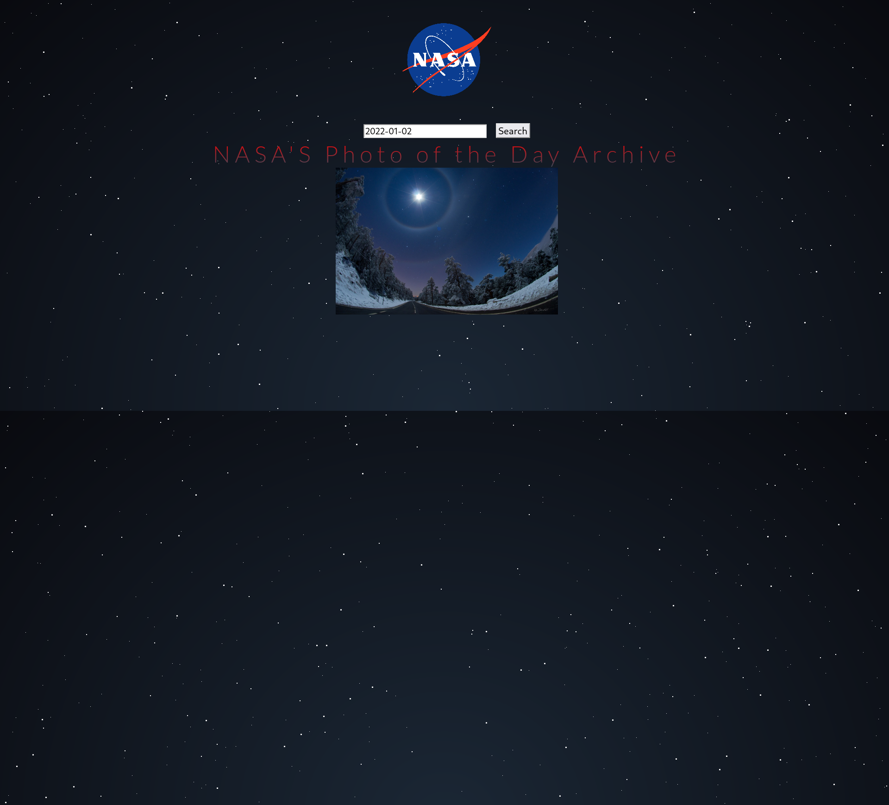

<h1 align="center">NASA's Photo of The Day</h1>

This program grabs a call from the NASA servers. It makes an API call and prints it out to a 
. All you have to do is type in the date as the format in the placeholder, and click search. This will print out an image from NASA's archive. 

## Links

- [Repo](<https://github.com/naderhassan001/nasa-archive-of-the-day> "<project-name> Repo")

- [Live](<http://nasaphotoarchive.s3-website-us-east-1.amazonaws.com/> "Live View")

## Screenshots

## Options for Running the Program 

In the project directory, you have a few options.

You can open the index.html file in a web browser or with the extention "liver server" in VsCode or your favorite editor. 

## Built With

- JavaScript
- HTML
- CSS
- NASA's Archive of the Day API

## Future Updates

- [ ] I have a plan to split the page into three parts, one for each unique piece of information that grabs a different API call. 
## Author

**Nader Hassan**

- [Profile](https://github.com/naderhassan001 "Nader Hassan")
- [Email](mailto:nader.hassan001@gmail.com "Hi!")

## 🤝 Support

Contributions, issues, and feature requests are welcome!

Give a ⭐️ if you like this project!
